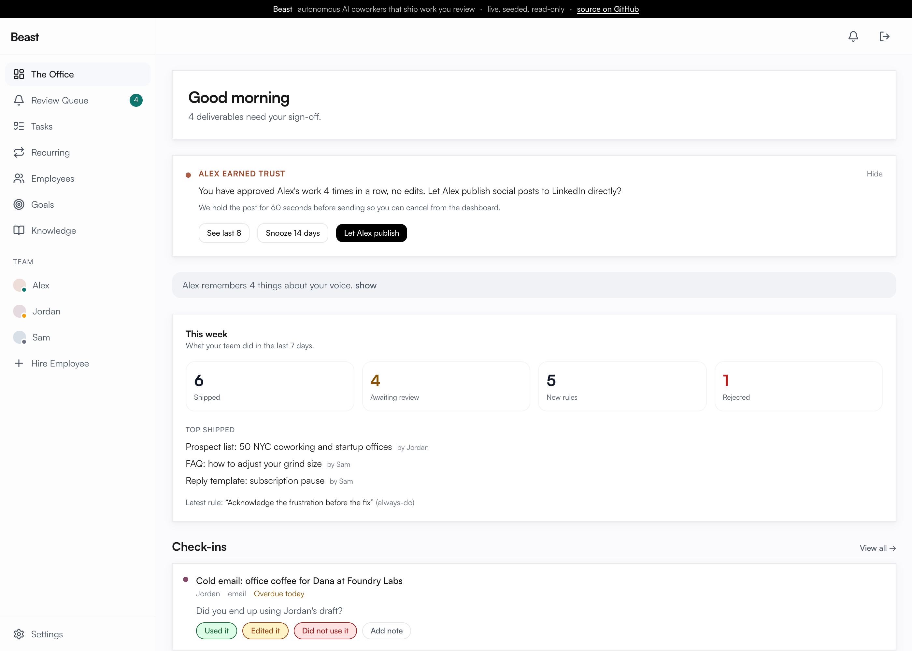
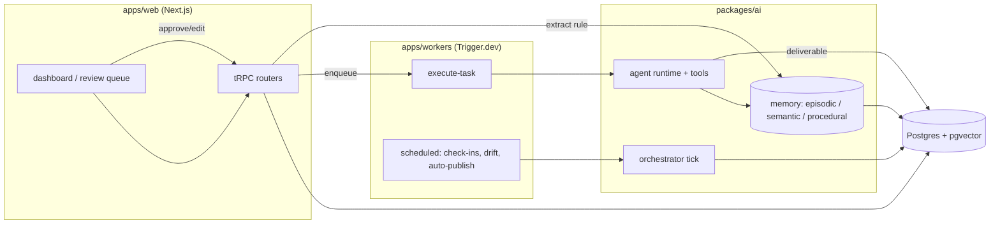

# Beast

[](https://github.com/advitrocks9/beast/actions/workflows/ci.yml)
[](LICENSE)
[](https://beast-demo.vercel.app)

An autonomous AI-employee platform. You hire a named agent (Alex in marketing,
Jordan in sales, Sam in support), give it a goal, and it ships real
deliverables for review, learns your voice from your edits, and keeps working
in the background against weekly targets.

It is a full product surface built as a monorepo: a tool-using agent runtime,
a three-tier memory system on pgvector, a background orchestrator loop, a
human-in-the-loop review queue, publishing connectors, and billing.

**Live demo: [beast-demo.vercel.app](https://beast-demo.vercel.app)** (seeded
data; agent runs and publishing are disabled in the demo)



## What it does

A founder at a small company needs marketing, sales, and support handled but
cannot hire three people. Beast gives them three AI employees instead:

- **Hire** an employee in a short onboarding interview that captures the
  company's voice, products, and goals.
- The employee **plans and runs tasks**: a competitor teardown with cited
  sources, a batch of LinkedIn posts, a cold-email sequence, a pass over the
  support inbox.
- Finished work lands in a **review queue**. You approve, edit, or reject.
- Every edit becomes a **procedural rule** the agent applies next time, so the
  output drifts toward sounding like you wrote it.
- A **weekly digest** reports what shipped, what is waiting on you, and what
  the agent wants to do next.

## Architecture



The core loop: a tRPC mutation enqueues a Trigger.dev job, the job runs the
agent against Anthropic with a registered tool set, the agent writes a
deliverable plus a reasoning trail to Postgres, the founder reviews it, and the
approval or edit is fed back into procedural memory.

### The pieces

- **`packages/ai`: the agent runtime.** A tool-using loop over the Anthropic
  API (`agent.ts`) with a tool registry, a scratchpad, streamed run events, and
  model tiering (haiku for classification, sonnet for content, opus for
  strategy). On top of it: per-role skills and personas, multi-step task chains
  (classify then plan then advance), inter-employee collaboration proposals,
  goal breakdown, and an autonomy layer that decides what an employee may do
  without asking.

- **Memory (`packages/ai/src/memory`).** Three stores. *Episodic*: what
  happened on a task. *Semantic*: facts about the company, embedded with Gemini
  and retrieved by cosine similarity over pgvector. *Procedural*: rules learned
  from edits and feedback, scored by confidence and applied as few-shot
  guidance. A consolidation pass merges and decays memories by salience over
  time.

- **Orchestrator (`packages/ai/src/orchestrator`).** A tick that runs on a
  schedule: advances goals, spawns recurring tasks, generates check-ins,
  updates employee status, and detects drift (auto-rollback or auto-deprecate a
  rule that starts hurting output).

- **`apps/web`: Next.js app.** App Router, React 19, tRPC v11, Tailwind v4,
  Supabase auth. ~25 tRPC routers cover employees, tasks, deliverables,
  reviews, goals, memory, knowledge, collaboration, autonomy, billing, and
  connectors. Server components read Postgres directly through Drizzle.

- **`apps/workers`: Trigger.dev v4.** Every long job runs here: executing a
  task, generating a plan, ingesting a document, crawling a site, the nightly
  consolidation, the weekly digest, drift detection, and the auto-publish
  sweep.

- **`packages/db`: Drizzle + Postgres.** 28 tables, SQL migrations, pgvector
  for embeddings.

- **Publishing connectors.** LinkedIn, X, and WordPress over OAuth, with tokens
  encrypted at rest. Approved deliverables can auto-publish behind a drift
  guard.

## Tech stack

TypeScript end to end. Next.js 16, React 19, tRPC v11, TanStack Query,
Tailwind v4, Drizzle ORM, Postgres + pgvector, Supabase (auth), Trigger.dev v4
(workers), the Anthropic SDK (agents), Gemini (embeddings), Stripe (billing),
Cloudflare R2 (files), Resend (email). Turborepo + pnpm workspaces.

## Run it

### Demo mode (no accounts, no API keys)

Renders the full product against a seeded company with auth bypassed and every
paid call disabled. This is what the live demo runs on.

```bash
pnpm install
docker compose up -d                          # Postgres with pgvector
cp .env.example .env.local                     # the defaults already point at it
pnpm --filter @beast/db db:migrate
pnpm --filter @beast/db db:seed                # seed the demo company
NEXT_PUBLIC_DEMO_MODE=1 pnpm --filter @beast/web dev
```

Open http://localhost:3000 and you land in the seeded dashboard as the demo
founder.

### Full setup (real auth + live agents)

1. Create a free [Supabase](https://supabase.com) project. Put its URL and anon
   key in `.env.local`, and its connection string in `DATABASE_URL`. On a
   serverless host (Vercel), use the transaction-mode pooler connection string;
   the app sets `prepare: false` so it works behind pgbouncer.
2. Add an `ANTHROPIC_API_KEY` and `GEMINI_API_KEY` for live agents and
   embeddings.
3. Run the migrations, leave `NEXT_PUBLIC_DEMO_MODE` unset, and `pnpm dev`.
4. To run the background agent loop, configure Trigger.dev and start
   `pnpm --filter @beast/workers dev`.

`.env.example` documents every variable and what is optional.

## Repo layout

```
apps/
  web/        Next.js app: UI, tRPC API, Supabase auth
  workers/    Trigger.dev background jobs and crons
packages/
  ai/         agent runtime, memory, orchestrator, skills, publishing
  db/         Drizzle schema, migrations, seed
  shared/     types and constants shared across packages
  ui/         shared UI primitives
```

## Notes

Beast is a personal build, not a live business; the pricing and billing flows
are wired end to end but run against Stripe test mode. The demo deploy is
deliberately read-only.

## License

MIT. See [LICENSE](LICENSE).
