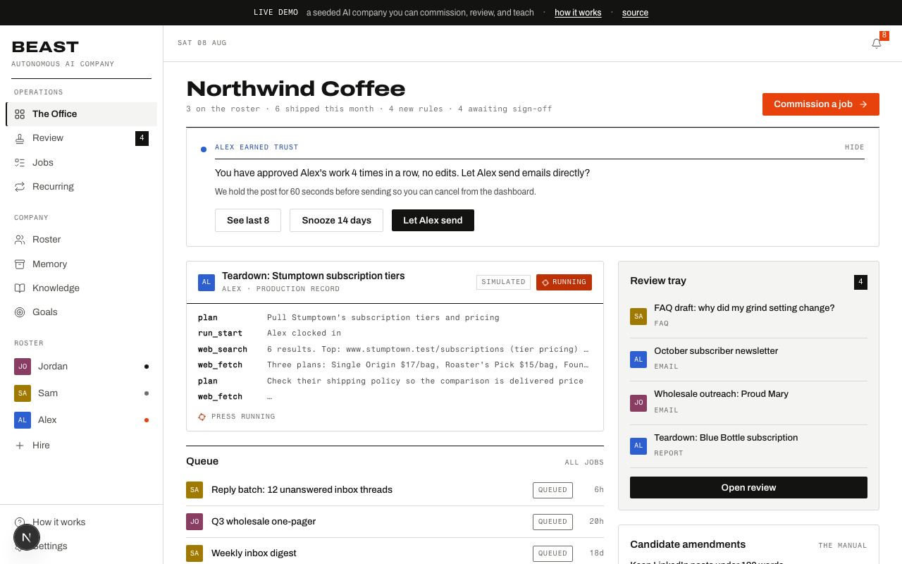
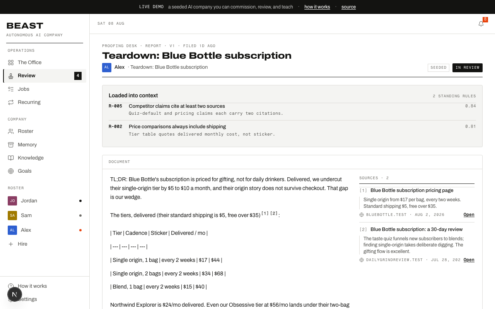
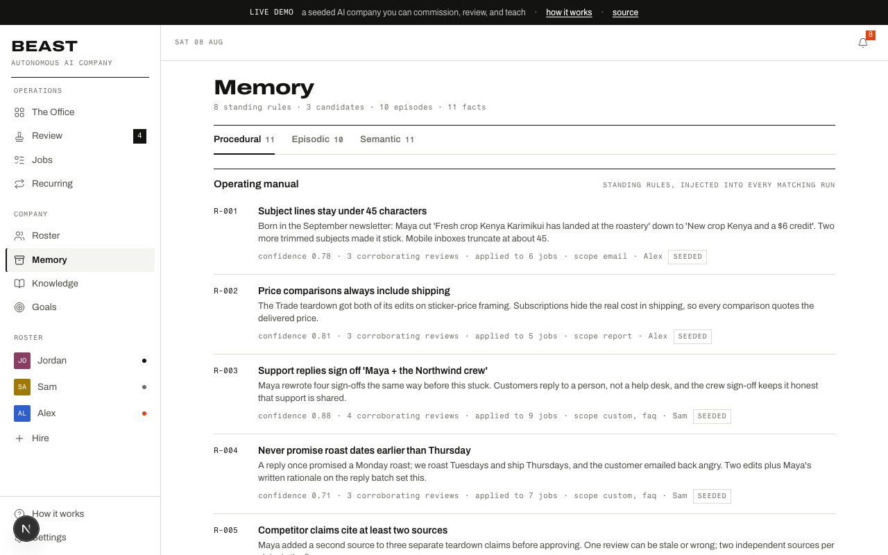
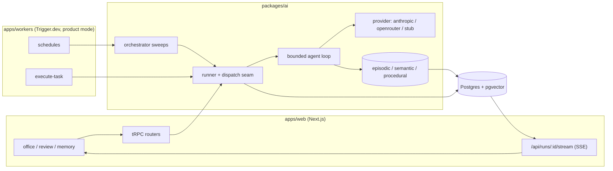

# Beast

[](https://github.com/advitrocks9/beast/actions/workflows/ci.yml)
[](LICENSE)
[](https://beast-demo.vercel.app)

An autonomous AI company you manage, not a chatbot you prompt. You brief it, agent
employees do the work in bounded tool loops, deliverables land in your review
queue, and your edits become the company's standing operating rules. The
interface is delegation and review. Every review makes the company permanently
better; no single review can make it worse.

**Live demo: [beast-demo.vercel.app](https://beast-demo.vercel.app)**, no signup.
You land in a seeded company with a run already on the press, commission a real
job, edit a deliverable, and watch the company amend its own operating manual.



## The loop

1. **Intake.** A job is briefed: title, deliverable spec, the employee it goes to. `queued`.
2. **Dispatch.** Commissioned jobs dispatch immediately; a scheduled orchestrator sweeps up
   anything stuck, times out stale runs, retries failures, and spawns recurring work.
3. **Execution.** A bounded tool loop: at most 50 steps and a hard wall clock. Standing rules
   are injected before the first step; similar past jobs are retrieved. `running`, steps
   streaming live.
4. **Filing.** The deliverable lands with its full trajectory attached: every tool call,
   source, and rule that shaped it. `in_review`.
5. **Review.** Accept, edit, or reject. The word-level diff of your edit is the training
   signal. `accepted` / `revised`, with honest `failed` and `timed_out` for the unhappy paths.
6. **Learning.** Edits distill into candidate rules with a confidence score,
   `1 - e^(-w/2)` over accumulated signal weight. Promotion needs both enough distinct
   corroborating reviews and confidence above 0.6. One review never promotes; a rule that
   starts hurting approval rates is rolled back by drift detection.

That last step is the moat, and the demo proves it instead of describing it: the seeded
candidate "Use 'folks', never 'guys'" sits at 2 of 3 corroborating reviews. Change one word
in the October newsletter and you watch it cross the gate and get stamped into the manual
as R-010, scoped to your visitor session so the shared seed stays pristine.



## Memory, browsable

Three tiers with distinct read points, all inspectable at `/memory`:

| tier | what it holds | read point |
|---|---|---|
| episodic | what happened on past jobs, outcomes included | planning, by similarity |
| semantic | facts the company has learned, pgvector embeddings | retrieval per run |
| procedural | the operating manual: numbered standing rules with confidence and origin | injected into every matching run's context |



## Honesty as a design rule

Everything renders its provenance: `SEEDED` history, `REPLAY` of recorded runs, `LIVE`
work from your session, `SIMULATED` when the deterministic stub provider ran, `STUB` on
externals the demo disables. Live runs are capped per visitor and per day; when the budget
is gone the demo says so and offers a replay. It never swaps one for the other silently.

## Architecture


```mermaid
flowchart LR
  subgraph web["apps/web (Next.js)"]
    UI[office / review / memory]
    TRPC[tRPC routers]
    SSE["/api/runs/:id/stream (SSE)"]
  end
  subgraph ai["packages/ai"]
    RUNNER[runner + dispatch seam]
    AGENT[bounded agent loop]
    PROV[provider: anthropic / openrouter / stub]
    MEM[(episodic / semantic / procedural)]
    ORCH[orchestrator sweeps]
  end
  subgraph workers["apps/workers (Trigger.dev, product mode)"]
    EXEC[execute-task]
    CRON[schedules]
  end
  DB[(Postgres + pgvector)]

  UI --> TRPC --> RUNNER
  RUNNER --> AGENT --> PROV
  AGENT --> MEM --> DB
  RUNNER --> DB --> SSE --> UI
  CRON --> ORCH --> RUNNER
  EXEC --> RUNNER
```

- **Provider layer** (`packages/ai/src/provider/`): one interface, three implementations
  resolved from env. Anthropic when keyed, OpenRouter free-tier models when keyed, and a
  deterministic stub otherwise, so the whole product runs end to end at $0 and every path
  stays testable. Tiering by `fast | standard | deep` per call site.
- **Run transport** (`packages/ai/src/runner.ts`): one dispatch seam. Trigger.dev in
  product mode, in-process otherwise; one SSE endpoint serves live events, paced replays,
  and simulated runs, each labelled.
- **Demo isolation** (`apps/web/src/trpc/init.ts`): visitors get a session overlay.
  Writes are copy-on-write rows stamped with the session id; reads overlay them on the
  shared seed; promoted rules and episodes carry the same scope; a nightly reset reseeds
  and purges expired sessions.
- **Orchestrator** (`packages/ai/src/orchestrator/`): a tick that runs three ways
  (Trigger.dev schedule, `/api/cron/tick` behind a bearer secret, direct call) so the
  company keeps moving on any host.

### If you only read a few files

- [`packages/ai/src/agent.ts`](packages/ai/src/agent.ts): the bounded tool loop with
  scratchpad planning and streamed run events.
- [`packages/ai/src/memory/extraction.ts`](packages/ai/src/memory/extraction.ts): how an
  edit becomes a rule. Word-level LCS diff, deterministic substitution extraction, signal
  accumulation, and the confidence gate. `accumulateSignal` is the only writer of
  procedural memory.
- [`packages/ai/src/runner.ts`](packages/ai/src/runner.ts): the run lifecycle, including
  timeout persistence and the quota-degrade path to labelled simulated runs.
- [`packages/db/src/seed.ts`](packages/db/src/seed.ts): the demo company. Rule confidences
  are computed with the real formula so seeded numbers are reachable states, not set
  dressing.
- [`packages/ai/src/memory/memory.test.ts`](packages/ai/src/memory/memory.test.ts): the
  moat pins. One review never promotes; three distinct reviews promote exactly once.

## The gate

CI runs typecheck, lint, unit pins, and an end-to-end smoke that commissions a canned job
in demo mode and asserts it reaches `in_review` with a real deliverable. Deploys only fire
on a green CI run and fail loudly on missing secrets, unreachable databases, or schema
drift, then health-check the deployed URL. A scheduled workflow probes uptime and runs the
orchestrator tick every 15 minutes and resets the demo nightly.

```bash
pnpm typecheck && pnpm lint && pnpm test
pnpm test:e2e
```

## Run it

### Demo mode, no keys

```bash
pnpm install
docker compose up -d
cp .env.example .env.local
pnpm --filter @beast/db db:migrate
pnpm --filter @beast/db db:seed
NEXT_PUBLIC_DEMO_MODE=1 pnpm --filter @beast/web dev
```

Open http://localhost:3000. Agent runs execute against the deterministic stub provider and
are labelled simulated. Add `OPENROUTER_API_KEY` or `ANTHROPIC_API_KEY` to `.env.local`
and the same runs go live, nothing else changes.

### Product mode

Supabase (auth, database with pgvector), your model key, and optionally Trigger.dev for
background workers, Stripe test mode for billing, and the publishing OAuth apps.
`.env.example` documents every variable and which mode needs it.

## Repo layout

```
apps/
  web/        Next.js app: UI, tRPC, SSE streaming, demo overlay
  workers/    Trigger.dev wrappers and schedules (product mode)
packages/
  ai/         agent loop, provider layer, memory, extraction, orchestrator
  db/         drizzle schema, migrations, the seeded company
  shared/     contract state machine, env validation, canned briefs
  ui/         shared primitives
```

## Notes

Beast is a personal build. Billing runs against Stripe test mode, publishing connectors
are real but optional, and the public demo is a seeded company with visitor sessions that
reset nightly.

## License

MIT. See [LICENSE](LICENSE).
