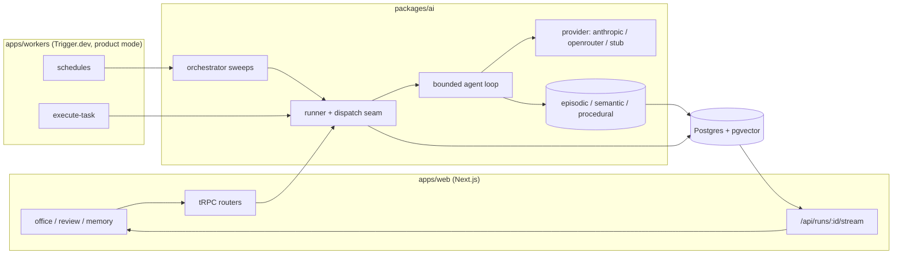

# Beast

Beast is an autonomous AI company. You brief jobs, agent employees run them in
bounded tool loops, deliverables land in a review queue, and your edits become
the company's standing rules. The interface is delegation and review, not
prompting.

**[beast-demo.vercel.app](https://beast-demo.vercel.app)**. No signup. A run is
already on the press when you land. Commission a job and it executes live
against a real model; edit a deliverable and watch the company amend its own
operating manual.


## The loop

Brief → queued → running → in_review → accepted or revised. Runs are bounded
(50 steps, hard wall clock) and file with their full trajectory: every tool
call, source, and rule that shaped them. `failed` and `timed_out` are real
states, and an orchestrator sweeps stuck runs, retries failures, and spawns
recurring work.

The learning gate is the core mechanism. Review edits are diffed word by word
and distilled into candidate rules. Confidence is `1 - e^(-w/2)` over
accumulated signal weight, and promotion requires both distinct corroborating
reviews and confidence ≥ 0.6, so a single review never rewrites the company.
Rules that start hurting approval rate are rolled back by drift detection.

The demo demonstrates this directly: the seeded candidate
`use 'folks', never 'guys'` sits at 2 of 3 corroborating reviews. Change one
word in the October newsletter and it promotes into the manual as R-010,
scoped to your visitor session so the shared seed stays clean.


## Memory

Three tiers, all browsable at `/memory`:

| tier | holds | read point |
|---|---|---|
| episodic | past jobs and outcomes | planning, by similarity |
| semantic | facts the company has learned, pgvector | retrieval per run |
| procedural | the operating manual: numbered rules with confidence | injected into every matching run |


## Architecture


```mermaid
flowchart LR
  subgraph web["apps/web (Next.js)"]
    UI[office / review / memory]
    TRPC[tRPC routers]
    SSE["/api/runs/:id/stream"]
  end
  subgraph ai["packages/ai"]
    RUNNER[runner + dispatch seam]
    AGENT[bounded agent loop]
    PROV[provider: anthropic / openrouter / stub]
    MEM[(episodic / semantic / procedural)]
    ORCH[orchestrator sweeps]
  end
  subgraph workers["apps/workers (Trigger.dev, product mode)"]
    EXEC[execute-task]
    CRON[schedules]
  end
  DB[(Postgres + pgvector)]

  UI --> TRPC --> RUNNER
  RUNNER --> AGENT --> PROV
  AGENT --> MEM --> DB
  RUNNER --> DB --> SSE --> UI
  CRON --> ORCH --> RUNNER
  EXEC --> RUNNER
```

- **Provider layer**: Anthropic, then OpenRouter's free tier, then a
  deterministic stub, resolved from env. The whole product runs end to end at
  $0 and every path stays testable. Model tiers (`fast | standard | deep`)
  route per call site.
- **One dispatch seam**: Trigger.dev in product mode, in-process otherwise. One
  SSE endpoint serves live events, paced replays, and simulated runs; every
  stream and artifact carries a provenance label (`seeded`, `replay`, `live`,
  `simulated`, `stub`).
- **Demo isolation**: visitor writes are copy-on-write rows keyed to a session
  cookie, overlaid on the shared seed at read time. Promoted rules and episodes
  carry the same scope. Live runs are rate-limited per visitor and per day and
  degrade to labelled replays past the budget. A nightly job purges sessions
  and reseeds.

### If you only read five files

- [`packages/ai/src/agent.ts`](packages/ai/src/agent.ts): the bounded tool
  loop, scratchpad planning, streamed run events.
- [`packages/ai/src/memory/extraction.ts`](packages/ai/src/memory/extraction.ts):
  how an edit becomes a rule. `accumulateSignal` is the only writer of
  procedural memory.
- [`packages/ai/src/runner.ts`](packages/ai/src/runner.ts): the run lifecycle,
  timeout persistence, and the quota-degrade path to labelled simulated runs.
- [`packages/db/src/seed.ts`](packages/db/src/seed.ts): the demo company.
  Seeded confidences are computed with the real formula, so every number is a
  reachable state.
- [`packages/ai/src/memory/memory.test.ts`](packages/ai/src/memory/memory.test.ts):
  the pins that matter. One review never promotes; three distinct reviews
  promote exactly once.

## The gate

```bash
pnpm typecheck && pnpm lint && pnpm test
pnpm test:e2e
```

CI runs all of it plus an e2e smoke that commissions a canned job in demo mode
and asserts it reaches `in_review` with a real deliverable. Deploys only ship
on green CI, fail loudly on missing secrets or schema drift, and health-check
the deployed URL. A scheduled workflow probes uptime every 15 minutes and
resets the demo nightly.

## Run it

Demo mode, no keys:

```bash
pnpm install
docker compose up -d
cp .env.example .env.local
pnpm --filter @beast/db db:migrate
pnpm --filter @beast/db db:seed
NEXT_PUBLIC_DEMO_MODE=1 pnpm --filter @beast/web dev
```

Open http://localhost:3000. Runs execute against the deterministic stub and are
labelled as simulated. Add an `OPENROUTER_API_KEY` (free) or
`ANTHROPIC_API_KEY` to `.env.local` and the same runs go live; nothing else
changes.

Product mode needs Supabase (auth plus a database with pgvector), a model key,
and optionally Trigger.dev for workers, Stripe test mode for billing, and the
publishing OAuth apps. `.env.example` documents every variable and which mode
needs it.

## Layout

```
apps/
  web/        Next.js app: UI, tRPC, SSE streaming, demo overlay
  workers/    Trigger.dev wrappers and schedules (product mode)
packages/
  ai/         agent loop, provider layer, memory, extraction, orchestrator
  db/         Drizzle schema, migrations, the seeded company
  shared/     state machine, env validation, canned briefs
  ui/         shared primitives
```

## Notes

Billing runs against Stripe test mode, publishing connectors are optional, and
the public demo resets nightly.

MIT. See [LICENSE](LICENSE).
